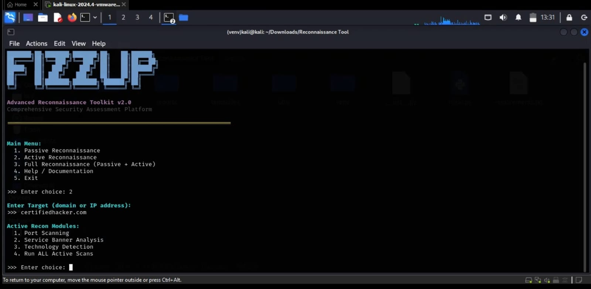
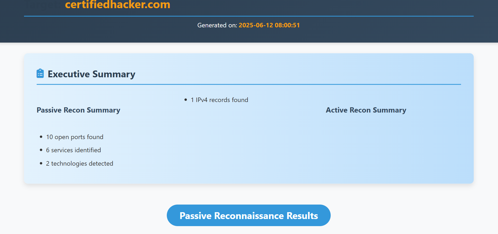

```bash

███████╗██╗███████╗███████╗██╗   ██╗██████╗ 
██╔════╝██║╚══███╔╝╚══███╔╝██║   ██║██╔══██╗
█████╗  ██║  ███╔╝   ███╔╝ ██║   ██║██████╔╝
██╔══╝  ██║ ███╔╝   ███╔╝  ██║   ██║██╔═══╝ 
██║     ██║███████╗███████╗╚██████╔╝██║     
╚═╝     ╚═╝╚══════╝╚══════╝ ╚═════╝ ╚═╝     
Advanced Reconnaissance Toolkit v2.0
-------------------------------------
```
FizzUp is a Python-based offensive reconnaissance tool...


# FizzUp Recon Toolkit

[](LICENSE)
[](https://github.com/yourusername/fizzup-recon-toolkit)

FizzUp is a Python-based **offensive security toolkit** designed for automated recon. It supports both **passive** and **active** scanning, presenting findings in detailed **HTML reports**. Built for ethical hackers, CTF players, and red teamers.

---

## Features

* . **Modular CLI interface** with real-time feedback
* . **Passive recon**: WHOIS, DNS, subdomain brute-forcing
* . **Active recon**: Port scanning, banner grabbing, tech fingerprinting
* . **HTML reports**: Clean, templated, downloadable
* . **Cross-platform & fast** — runs anywhere Python 3.8+ works

---

## Folder Structure

```text
fizzup-recon-toolkit/
├── main.py                  # Entry point
├── modules/
│   ├── passive/             # WHOIS, DNS, Subdomain
│   └── active/              # Port scanning, banners
├── utils/                   # Helpers and wrappers
├── templates/               # Jinja2 HTML templates
├── reports/                 # Output HTML reports
├── requirements.txt
├── README.md
└── CONTRIBUTORS.md
```

---

##  Installation

### Requirements

* Python 3.8+
* pip modules in `requirements.txt`

### Quick Setup

```bash
git clone https://github.com/yourusername/fizzup-recon-toolkit.git
cd fizzup-recon-toolkit
python3 -m venv venv
source venv/bin/activate  # Windows: venv\Scripts\activate
pip install -r requirements.txt
```

---

##  Usage

```bash
python main.py
```

Follow the prompt:

```text
[1] Passive Recon
[2] Active Recon
[3] Generate Report
[4] Exit
➤ Your Choice:
```

### Example

```text
➤ Enter domain/IP: example.com

✔ WHOIS data found
✔ DNS A, MX, TXT records collected
✔ Subdomains discovered: www, blog, mail

→ HTML report generated: reports/example_report.html
```

---

##  Modules Overview

###  Passive Recon

| Module         | Description                         |
| -------------- | ----------------------------------- |
| `who_is.py`    | WHOIS info for IP/domains           |
| `dns_enum.py`  | DNS A, MX, TXT, NS, CNAME           |
| `subdomain.py` | Brute-force or API-based subdomains |

---

###  Active Recon

| Module           | Description                             |
| ---------------- | --------------------------------------- |
| `port_scan.py`   | Scans open TCP ports with service hints |
| `banners.py`     | Grabs banners like SSH, FTP, HTTP       |
| `tech_detect.py` | Web tech stack identification           |

---

##  HTML Report Generator

* Uses **Jinja2 templates**
* Clean layout with collapsible sections
* Stored in `/reports/` with target timestamp


---

##  Screenshots

| CLI Interface             | HTML Report                 |
| ------------------------- | --------------------------- |
| | |

---

## 🧪 Sample Output

> A sample recon HTML report is included:
> [🔗 `reports/sample_report.html`](reports/fullreport.html)

---

##  Python Module Usage

You can also use the modules in your own Python projects:

```python
from modules.passive import who_is

result = who_is.lookup("example.com")
print(result)
```
---

## 🐳 Docker Support

Run FizzUp inside a container for easier dependency management.

###  Build Docker Image

```bash
docker build -t fizzup-recon .
```

###  Run the Tool via Docker

```bash
docker run --rm -it fizzup-recon
```

###  Development Mode (Mount Your Code)

```bash
docker run --rm -it -v $(pwd):/app fizzup-recon
```

> **Note**: Use `$(pwd)` on Linux/macOS or `%cd%` on Windows CMD, `$PWD` in PowerShell.

---

---

##  Contributors

See [CONTRIBUTORS.md](CONTRIBUTORS.md)

---

##  License

MIT License — see [`LICENSE`](LICENSE)

---

##  Acknowledgements

* Inspired by: Sublist3r, Nmap, WhatWeb
* Thanks to: ITSOLERA Internship (2025)
* Uses: Python, Jinja2, Requests

---

## Legal Notice

This toolkit is for **educational** and **authorized testing** only.
**Do NOT** scan or interact with systems without explicit permission.

---

##  Support & Feedback

If you like this project:

*  Star it on GitHub
*  File an issue or feature request
*  Share with fellow infosec learners

---

**Built with 🧠 by Fizzup-Team — FizzUp: Automate. Detect. Report.**
